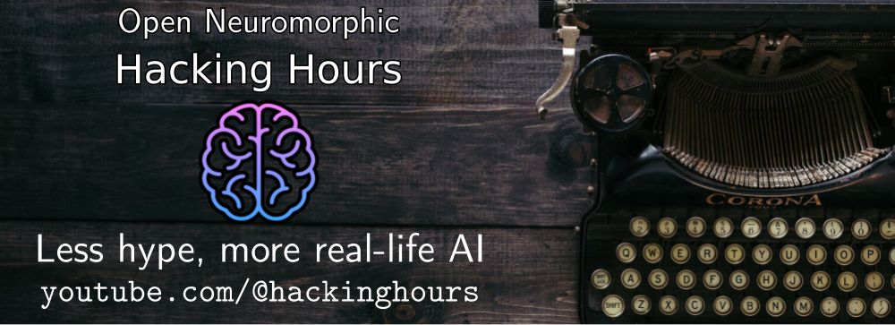

[Neuromorphic technologies](https://en.wikipedia.org/wiki/Neuromorphic_computing) are fascinating new ways to build computers, inspired by the brain.
The ecosystem around neuromorphics is rapidly growing, and we have a unique window of opportunity to build accessible, fast, and reliable software for neuromorphic technologies.
Help us by resolving issues below and join our community coding sessions where we improve the neuromorphic software ecosystem, one issue at the time 🚀

We'll meet **every Monday from 16-18 CET/CEST** on the [Open Neuromorphic Discord server](https://discord.gg/aPFsSRA7Nf) and we record our events on the [YouTube channel @HackingHours](https://www.youtube.com/@hackinghours)

The goal is to meet up, hack on projects, close issues, and have fun!

## 🚀 Completed pull requests and issues 🚀
The entire point is to move things forward, get stuff done, and provide real value! The below issues and pull requests were all closed during the hacking hours:

* [Faery](https://github.com/aestream/faery/): [#10](https://github.com/aestream/faery/pull/10), [#15](https://github.com/aestream/faery/pull/15), [#16](https://github.com/aestream/faery/pull/16) [#22](https://github.com/aestream/faery/pull/22)
* [NIR](https://github.com/neuromorphs/nir/): [#76](https://github.com/neuromorphs/nir/pull/76), [#104](https://github.com/neuromorphs/nir/pull/104) [#122](https://github.com/neuromorphs/NIR/pull/122) [#124](https://github.com/neuromorphs/NIR/pull/124) [#128](https://github.com/neuromorphs/NIR/pull/128) [#130](https://github.com/neuromorphs/NIR/pull/130) [#143](https://github.com/neuromorphs/NIR/pull/143) [#153](https://github.com/neuromorphs/NIR/pull/153) [#156](https://github.com/neuromorphs/NIR/pull/156)
* [NIRTorch](https://github.com/neuromorphs/nirtorch/): [#28](https://github.com/neuromorphs/nirtorch/pull/28) [#33](https://github.com/neuromorphs/nirtorch/pull/33) [#34](https://github.com/neuromorphs/NIRTorch/pull/34) [#36](https://github.com/neuromorphs/NIRTorch/pull/36) [#34](https://github.com/neuromorphs/NIRTorch/pull/34) [#39](https://github.com/neuromorphs/NIRTorch/pull/39) [#40](https://github.com/neuromorphs/NIRTorch/pull/40) [#41](https://github.com/neuromorphs/NIRTorch/pull/41)
* [Norse](https://github.com/norse/norse): [#409](https://github.com/norse/norse/pull/409) [#422](https://github.com/norse/norse/pull/422)
* [Open-Neuromorphic.github.io](https://github.com/open-neuromorphic/open-neuromorphic.github.io): [#169](https://github.com/open-neuromorphic/open-neuromorphic.github.io/pull/169)

## Projects with open issues that needs help
Want to help out? Pick a project you care about and start hacking 👇

<!-- NOTE TO CONTRIBUTORS
Every hour, a script will search for two HTML comment tags with the org/repo name.
Everything between the tags WILL BE REPLACED with issues that are open AND have the talk "help wanted".
If you want to add your own project, simply add three lines:
1. The header with the project title,
2. The starting HTML comment, and
3. The ending HTML comment
-->

### [Faery](https://github.com/aestream/faery) - Event streaming multitool with an efficient Rust core
 
<!-- aestream/faery -->
* [Add documentation](https://github.com/aestream/faery/issues/4)
* [Add UDP I/O](https://github.com/aestream/faery/issues/3)
* [Add GPU frames via DLPack](https://github.com/aestream/faery/issues/2)
<!-- aestream/faery -->

### [Neuromorphic Intermediate Representation (NIR)](https://github.com/neuromorphs/nir) - A neuromorphic continuous-time instruction set
 
<!-- neuromorphs/nir --> 
No open issues that need help
<!-- neuromorphs/nir -->

### [NIRTorch](https://github.com/neuromorphs/nirtorch) - PyTorch-NIR integration library
 
<!-- neuromorphs/nirtorch --> 
No open issues that need help
 <!-- neuromorphs/nirtorch -->

### [NIRViz](https://github.com/open-neuromorphic/nirviz) - NIR visualization for Python and CLI
 
<!-- open-neuromorphic/nirviz --> 
No open issues that need help
<!-- open-neuromorphic/nirviz -->
 
### [Norse](https://github.com/norse/norse) - A functional spiking neural network simulator for deep learning
 
<!-- norse/norse --> 
No open issues that need help
<!-- norse/norse -->

### [snnTorch](https://github.com/jeshraghian/snnTorch) - Deep and online learning with spiking neural networks in Python
 
<!-- jeshraghian/snntorch --> 
No open issues that need help
 <!-- jeshraghian/snntorch -->

## How to contribute
Join the chat, update this README file with your project, or just reach out on our Discord.

## Acknowledgements
Community coding projects is organized by [Jens E. Pedersen](https://github.com/jegp) and hosted by the [Open Neuromorphic organization](https://github.com/open-neuromorphic).
